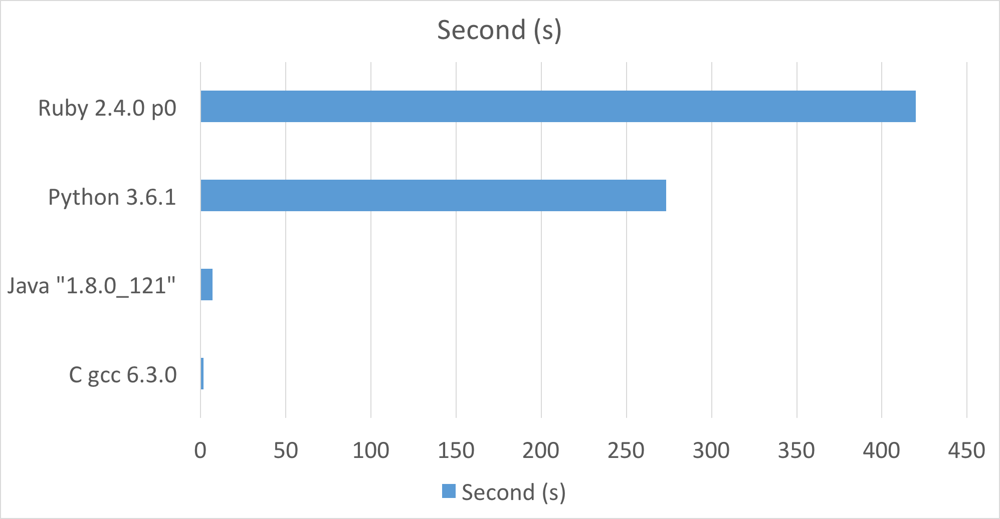
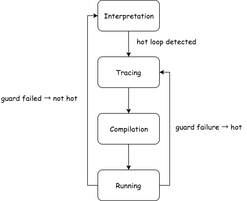

class: center, middle, inverse

# Tracing the Meta-Level: PyPy's JIT compiler

## Yusuke Izawa
### Hidehiko Masuhara lab.

2017-07-21
---
class: middlle
# Overview

--
1. introduce the paper

  1. Introduction

  1. Tracing JIT Compiler

  1. Tracing the Meta-Level

  1. Evaluation

  1. Conclutsion

1. My Future Work

---
class: center, middle, inverse

# Introduction

---

# Introduction: Speed on Run-Time

--

- .green[Fast]: Statically Typed Languages

- .red[Slow]: Dynamic Languages

--

##### Example benchmark: Mandelbrot description

.center[

]

.footnote[http://benchmarksgame.alioth.debian.org/u64q/mandelbrot.html]

---

# Introduction: Interpreter and Just-In-Time Compiler

## Implementation

--
- .green[Easy]: interpreter

  - straightforward

--
- .red[Hard]: just-in-time compiler

  - complicated techniques

---

# Introduction: What is PyPy?

--

## Solve the implementation problem

- Aim to be the __environment__ for writing _flexible implementations_ of dynamic languages

--

## Solve the speed promblem

- Get better the performance with Tracing JIT compiler

---
class: center, middle, inverse

# Demo for the PyPy

---
class: center, middle, inverse

# Tracing JIT Compiler
---

# Background: Assumptions of Tracing JIT Compiler

--
## Assumptions

- programs spend most of their runtime in loops

- everal iterations of the same loop are likely to take similar code paths

---
# Internal Techniques: Tracing JIT Compiler

Tracing JIT techniques is built on above assumptions.

--

## Phases
- Interpretation / Profiling
- Tracing
- Compilation
- Running

--

## Devises

- Guards
- Position key

---

# Overview: Tracing JIT Compiler
.center[

]

---
# Phases: Interpretation / Profiling

- when the program starts, everything is interpreted

--
-  do profiling

  - counts how often the *backwark jump** is executed

  - too many jumps → .red[Hot Loop]

.footnote[.red.bold[*] jump to the previous instruction]

---
# Phases: Tracing

## Conditions for Entering

- when .red[Hot Loop] is identified

--

## Subject doing tracing

- Tracer

--

## During

- records a history of all the executed oprations*

.footnote[.red.bold[*] name: Trace]

---
class: middle, center, inverse

# [Code Example for the Trace](./trace.html)

---

# Phases: Compilation (code generation)

generate efficient machine code using a trace

---

# Phases: Running (code execution)

execute machine codes made at compilation phases

---

# Devices: Gurad

## Role

--

- ensure correctness in progress

- a guard failing, *fall back to* **interpretation phase**

--

## Usecase

- places guard at every possible point where the path could go another direction

---

# Devices: Position Key

## Role

--

- recognizes the corresponding loop for a trace

- describes the position of the execution of the program

  - have executed functions and program counter

--

## Usecase
- check position key at backward branch instruction*

.footnote[.red.bold[*] to check the loop is closed]

---
class: center, middle, inverse

# [Tracing the Meta-Leve](./tracing_the_meta_level.html)
